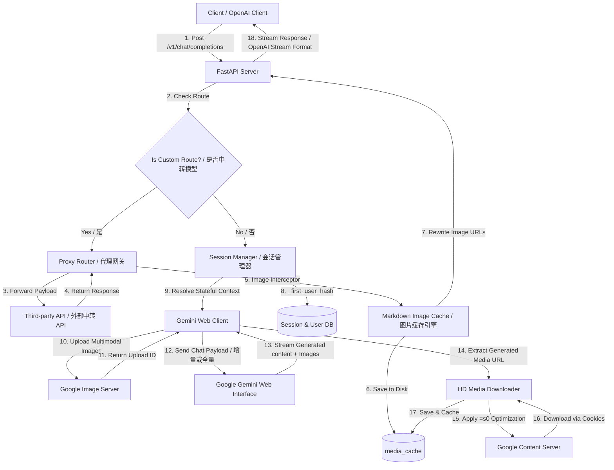

# ♊ Gemini Web-to-API Adapter | Gemini 网页版 API 转换器

<div align="center">

[](https://opensource.org/licenses/MIT)
[](https://www.python.org/)
[](https://fastapi.tiangolo.com/)
[](https://vuejs.org/)
[](https://vitejs.dev/)

**[English](#english) | [简体中文](#简体中文)**

*A high-performance reverse-engineered gateway that turns Gemini Web (Advanced supported!) into an OpenAI-Compatible API. Zero-cost access to Gemini 3.5 Flash (with Expanded Thinking logs and the "Banana" image modality), Imagen 3, and smart session continuity.*

*一个高性能的反向工程网关，将 Gemini 网页版（支持 Advanced 账户！）转换为标准的 OpenAI 兼容 API。零成本开启最新 Gemini 3.5 Flash（支持拓展思考与 Banana 图片模态）、Imagen 3 图像生成、深度思考过程（Thinking Process）以及智能会话续接。*

</div>

---

## 📖 Table of Contents / 目录
- [Architecture & Request Flow / 架构与请求流程](#-architecture--request-flow--架构与请求流程)
- [Key Features & Technical Deep Dive / 核心功能与技术内幕](#-key-features--technical-deep-dive--核心功能与技术内幕)
  - [1. Gemini Image Generation & Resolution Optimization / Gemini 绘图与分辨率优化](#1-gemini-image-generation--resolution-optimization--gemini-绘图与分辨率优化)
  - [2. Intelligent Session Management / 智能会话管理](#2-intelligent-session-management--智能会话管理)
  - [3. Multi-modal Third-Party Proxy Gateway / 多模态中转与第三方代理](#3-multi-modal-third-party-proxy-gateway--多模态中转与第三方代理)
  - [4. Gemini 3.5 Flash & Banana Image Modality / 3.5 Flash 拓展思考与 Banana 模态](#4-gemini-35-flash--banana-image-modality--35-flash-拓展思考与-banana-模态)
- [🛠️ Tech Stack & Database / 技术栈与数据库](#%EF%B8%8F-tech-stack--database--技术栈与数据库)
- [🚀 Quick Start / 快速开始](#-quick-start--快速开始)
- [📝 Developer's Rants & Insights / 开发者吐槽与碎碎念](#-developers-rants--insights--开发者吐槽与碎碎念)

---

## 📐 Architecture & Request Flow / 架构与请求流程

Below is the execution flow of how the Gemini Web API gateway intercepts, translates, and manages incoming requests:

下图展示了 Gemini Web API 网关拦截、转换和管理传入请求的完整执行流程：



---

<a name="english"></a>

## 🌟 Key Features & Technical Deep Dive (English)

### 1. Gemini Image Generation & Resolution Optimization
When you ask Gemini Web to generate images (powered by Imagen 3 under the hood), Google returns temporary CDN links pointing to `googleusercontent.com`. This adapter handles these generated images through a robust pipeline:
- **Auto-HD Upgrading (`=s0`)**: By default, Google returns low-resolution preview URLs (e.g. trailing with `=w700`, `=s400`). The backend parses these URLs and automatically replaces the size parameters with `=s0`, which forces Google's content servers to deliver the **full-resolution original quality** image.
- **Authenticated Downloading**: Google's CDN restricts hotlinking. The server downloads the generated image asynchronously using the client's current session cookies (`__Secure-1PSID`, etc.) and a spoofed browser User-Agent to bypass protection.
- **Local Persistence & Proxying**: The media files are stored on disk in the `media_cache` directory. The response returned to the client replaces the ephemeral Google URLs with local proxy paths (e.g., ``). This guarantees that images **never expire** and load instantly.

```python
# Technical snippet from client.py showcasing the URL resolution upgrade
if ("googleusercontent" in url or "ggpht" in url) and not is_video:
    # Strip existing width/height constraints and request full quality (=s0)
    url = re.sub(r'=w\d+(-h\d+)?(-[a-zA-Z]+)*$', '=s0', url)
    url = re.sub(r'=s\d+(-[a-zA-Z]+)*$', '=s0', url)
    url.endswith('=s0') or (url += '=s0')
```

---

### 2. Intelligent Session Management (Full & Incremental Appending)
OpenAI clients operate in a *stateless* mode (sending the entire message array on every prompt), whereas Gemini Web uses a *stateful* architecture (requiring a `conversation_id` and tracking context on Google's servers). This adapter bridges the gap seamlessly:
- **Stable Hashing (`_first_user_hash`)**: Rather than asking clients to store stateful identifiers, the server hashes the content of the **first user message** in the incoming history list. This hash serves as a unique session fingerprint.
- **Incremental Mode (`messages[-1:]`)**: If the fingerprint matches an active running session, the adapter retrieves the cached Google conversation credentials (`conversation_id`, `response_id`, `choice_id`). Instead of sending the full history back to Google (which would cause errors and duplicate contents), it sends **only the latest user message**. Google's server automatically appends this to the existing thread.
- **Full Mode (Context Reconstruction)**: If the session is new (or has been reset via `/v1/client/reset`), the server sends the full message array to establish the thread on Google's backend.
- **Auto-Fallback & Invalidation**: If Gemini returns an empty response due to context corruption, the server automatically invalidates the cached session keys, resets the context, and retries the request to ensure zero user disruption.

---

### 3. Multi-modal Third-Party Proxy Gateway
Apart from wrapping Gemini Web, the adapter supports a configurable **routing proxy** (`CUSTOM_APIS`) that forwards models to other APIs (e.g., Midjourney, DALL-E, Claude).
- **Multi-modal payload parser**: The server accepts standard OpenAI multi-modal messages (Base64 data URLs or remote image URLs). The backend extracts the media, uploads it directly to Google's contribution servers (or target APIs) using chunked boundary payloads, and streams back the responses.
- **Image Generation Stream Fallback**: Standard image models do not support SSE (Server-Sent Events) streaming. The proxy detects if a model contains `image` or `dall` in its name and forces `stream=False` upstream, preventing connection disconnects.
- **Markdown Image Proxy**: If a third-party image API returns external image URLs in Markdown format, the proxy interceptor catches them, downloads them asynchronously to the local `media_cache`, and rewrites the Markdown paths. This hides your upstream image generator URLs, preserves anonymity, and secures links against expiration.

---

### 4. Gemini 3.5 Flash & Banana Image Modality Support
This adapter is updated to support the latest web-side API updates from Google:
- **Expanded Thinking Reasoning Logs**: Fully extracts the internal chain-of-thought/reasoning logs returned by Gemini 3.5 Flash. It translates this thinking trace into standard OpenAI compatible thinking block structures, allowing you to monitor the AI's logical progression in real-time.
- **"Banana" Multimodal Processing**: Seamlessly handles image and video files uploaded via the new visual backend (code-named "Banana") in Gemini 3.5 Flash. It optimizes boundary headers and payload structures during streaming to guarantee high-speed, multi-modal context understanding without dropping connection frames.

---

<a name="简体中文"></a>

## 🌟 核心功能与技术内幕 (简体中文)

### 1. Gemini 绘图与分辨率优化
当你在对话中要求 Gemini 生成图片时（底层基于 Imagen 3），Google 会在响应数据中返回托管在 `googleusercontent.com` 上的临时图片链接。本适配器提供了一条完美的媒体下载缓存流水线：
- **无损画质升级 (`=s0`)**：Google 默认返回带有尺寸限制的预览图（例如链接末尾包含 `=w700` 或 `=s400`）。适配器会自动利用正则表达式将这些后缀强制重写为 `=s0`，获取 **无压缩的原始画质高清大图**。
- **带 Cookie 鉴权下载**：Google CDN 对绘图资源设置了防盗链。适配器内部复用了当前对话的 Google 会话 Session，携带相同的 `__Secure-1PSID` 等 Cookie 信息并伪装浏览器 Header，安全下载生成的文件。
- **本地持久化与反向代理**：下载的文件以 UUID 重命名保存在本地的 `media_cache` 目录中。适配器将回复文本中原本的临时 Google 链接改写为本地代理路径（如 ``），确保生成的图片**永久有效**，不再随 Google 缓存失效而无法查看。

---

### 2. 智能会话管理（全量与增量对话追加）
OpenAI 客户端是 **无状态** 的（每次请求都会把历史消息从头到尾发一遍），而 Gemini 网页版是 **有状态** 的（基于服务端的会话 ID 维护上下文）。本网关通过巧妙的设计实现了无缝转换：
- **首字稳定哈希 (`_first_user_hash`)**：不需要客户端配合记录任何繁琐 Session ID。网关自动提取输入历史记录中的**第一条用户消息**进行 SHA-256 哈希计算，以此作为该会话的唯一指纹。
- **增量追加模式 (`messages[-1:]`)**：如果指纹命中已存在的活跃会话，网关将提取该会话绑定的 Google `conversation_id`。此时，**仅将最后一条用户/工具消息** 发送给 Gemini。由于前面的上下文已经在 Google 端的 Session 内存中，这样不仅极大地节约了网络开销、缩短了响应时间，还彻底避免了重复历史记录导致的报错。
- **全量模式（上下文重建）**：若会话不存在（如新开启的对话，或通过控制台重置了该会话），网关则全量发送所有历史消息，在 Google 后端快速重建上下文。
- **空回复自动重置**：复用会话时，若因 Google 侧上下文失效而返回空数据，网关会自动调用 `invalidate_session` 清空该会话的上下文记录，并重新建立连接进行重试，用户端完全无感知。

---

### 3. 多模态中转与第三方代理
除了 Gemini 网页版以外，本网关内置了动态中转引擎（在 `config_data.json` 或 `.env` 中通过 `CUSTOM_APIS` 配置），支持灵活分流到其他第三方 API。
- **多模态数据解析**：全面兼容 OpenAI 多模态格式（支持 Base64 Data URL 以及远程 HTTP 图片链接）。后台会自动将 Base64 解码或下载远程图片，通过分块（Multipart）格式上传至 Google 的上传接口获取上传 ID。
- **非流式静默切换**：针对图像生成模型（如 Midjourney 或 DALL-E 中转），由于上游不支持 SSE 流式传输，网关会在检测到模型名含 `image` 或 `dall` 时，强行将 Payload 修改为 `stream=False` 并执行普通 POST 请求，防止连接中断。
- **Markdown 图片本地化劫持**：对于中转 API 返回的 Markdown 图片，代理模块会自动提取图片 URL，由后台异步将其下载并缓存至本地 `media_cache` 中，最后用 `/media/proxy_xxx` 本地地址替换原文。这一机制极大增强了隐私性，并解决了中转站图片链接失效的问题。

---

### 4. Gemini 3.5 Flash 拓展思考与 Banana 图片模态支持
针对 Google 网页端 API 的最新升级，本适配器已完美跟进：
- **拓展思考推理日志 (Expanded Thinking)**：全面支持抓取和解析最新 Gemini 3.5 Flash 返回的内部思维推理链，能够完美提取 thought trace 并以标准 OpenAI 格式的推理块形式输出，让您可以直观地观测 AI 思考的逻辑演变过程。
- **"Banana" 多模态图片解析**：无缝适配 Gemini 3.5 Flash 网页版最新采用的高性能视觉处理框架（内部代号 "Banana"）。通过重构上传流中的 Boundary 头部信息和多维分块格式，确保上传图片/视频进行多模态分析时响应速度更快，彻底告别丢帧和长文本卡死。

---

## 🛠️ Tech Stack & Database / 技术栈与数据库

- **Backend / 后端**: `FastAPI` + `Uvicorn` + `HTTPX` (High-performance async server for rapid stream handling / 用于快速流式响应的高性能异步服务)
- **Database / 数据库**: `PostgreSQL` / `SQLite` (Handles user registration, custom API keys, and comprehensive token logging / 用于用户管理、API 密钥授权及使用统计日志)
- **Frontend / 前端**: `Vue 3` + `TypeScript` + `Vite` + `Pinia` (Sleek admin portal to manage active Google web sessions, clean caches, and trace real-time API logs / 现代化的后台控制台，可实时管理 Google 活跃会话、清理缓存、监控请求日志)

---

## 🚀 Quick Start / 快速开始

### 1. Prerequisites / 准备工作
Ensure you have Python 3.9+ and PostgreSQL installed. (You can also modify `db_manager.py` to use SQLite if you prefer a database-free quick start).

确保安装了 Python 3.9+ 和 PostgreSQL 数据库。

### 2. Installation / 安装步骤

Clone the project and install requirements:
克隆项目并安装依赖：
```bash
# Clone and enter directory / 进入项目目录
cd gemini-web-api

# Install requirements / 安装依赖
pip install -r requirements.txt
```

### 3. Configuration / 配置文件
Create a `.env` file in the root directory (refer to the sample below):
在根目录创建 `.env` 文件（参考如下配置）：
```env
DB_NAME=user_system
DB_USER=postgres
DB_PASSWORD=your_db_password
DB_HOST=127.0.0.1
DB_PORT=5432

HOST=0.0.0.0
PORT=7788
ALLOW_DB_API_KEYS=true

TOKEN_REFRESH_INTERVAL_MIN=200
TOKEN_REFRESH_INTERVAL_MAX=300
TOKEN_AUTO_REFRESH=true
TOKEN_BACKGROUND_REFRESH=true
```

In `config_data.json`, populate your Google Web cookies (`__Secure-1PSID`, `__Secure-1PSIDTS`, etc.) retrieved from your browser devtools when logged into `gemini.google.com`.

在 `config_data.json` 中，填入你从浏览器开发工具中获取的 Google Gemini 网页端 Cookie (包括 `__Secure-1PSID`, `__Secure-1PSIDTS` 等)。

### 4. Running the Server / 运行项目

Start the Python FastAPI gateway:
运行后端服务：
```bash
python server.py
```

Launch the Vue 3 management console:
运行前端管理后台：
```bash
cd frontend
npm install
npm run dev
```
Open `http://localhost:5173/admin` (or your Vite local port) to access the UI dashboard!

---

## 📝 Developer's Rants & Insights / 开发者吐槽与碎碎念

### 💬 为什么要造这个轮子？
官方的 Gemini API 虽然好用，但是 **限制多** 并且 **Advanced 账户的权益（比如更聪明的 Ultra/Experimental 模型，最新的 Imagen 3 画质）在 API 里是体验不到的**，或者计费贵到肉疼。
网页端明明开通了 Advanced 却只能在浏览器里手点？这坚决不能忍！为了把网页端强大的多模态和无限次对话能力接进我们心仪的客户端（如 NextChat, LobeChat），才有了这个逆向网关。

### 🤯 那些年踩过的坑
1. **Google 的“套娃式”多维数组 (Proto-like JSON Array)**:
   如果你去抓包过 Google Gemini Web 接口，你会发现它的数据结构简直是人类审美的灾难。没有标准的 JSON 键值对，全部是无限嵌套的数组（比如 `[[["x", [["y", ...]]]]]`). 为了提取出准确的 `conversation_id`、深度思考过程、图片 URL，我们写了上百行的递归代码 (`_extract_image_path`, `_extract_generated_media`)。每当 Google 调整一下前端排版，代码就得跟着重构，简直是掉发利器。
   
2. **两小时失效的图片链接**:
   一开始我们欢天喜地地把抓到的图片 URL 直接传给前端，结果发现：**怎么过了俩小时全部裂开了？！** 原来 Google 加上了过期时间戳和防盗链。最后只能在网关里做了一套**无感的本地缓存代理（Media Cache Proxy）**。下载的时候还得带上用户的 Cookie 去“偷”图，再用 `FileResponse` 喂给前端，虽然费了番功夫，但终于实现了图片永久保存。
   
3. **难缠的会话状态转换**:
   OpenAI 客户端根本不讲武德，只要你对话变长，它就把几万字的历史记录全部打包一次性塞过来。如果网关也跟着老老实实发给网页端，网页端会因为“收到已存在的历史对话”直接报错拒绝回答。
   我们后来灵机一动：**干脆用第一条用户消息的 Hash 做唯一标识！** 只要是同一个会话，首条消息必定相同。定位到老会话后，我们直接把 OpenAI 发过来的几万字丢掉，**只发最新那一条（增量追加）**。不仅网页端顺畅响应，网关带宽压力也瞬间减小了 90%！

---

<div align="center">

**Made with ❤️ by hackers who love Gemini.**
**觉得有用的话，别忘了点个 Star 🌟 鼓励一下作者！**

</div>
